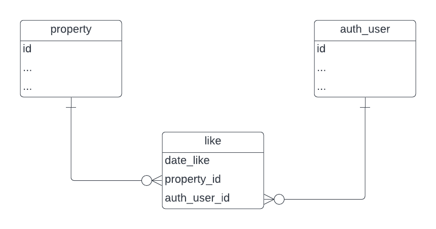

# Habi - Prueba Técnica
Se implementarán dos microservicios que Habi desea tener. El primero para que los usuarios externos puedan consultar los inmuebles disponibles almacenados en la base de datos. El segundo para que los usuarios puedan darle “Me gusta” a un inmueble en específico. Este último su impletación será solo conceptual.

## Consideraciones Técnicas
Estas consideraciones son iniciales. La implementación final podría diferir al encontrarse dificultades en este primer diseño.

### Bibliotecas
La bibliotecas de Python más relevantes que se usarán en este proyecto son:
- [http](https://docs.python.org/3/library/http.html#module-http): se utilizará para crear el servidor HTTP y manejar las peticiones de los usuarios.
- [MySQL connector/python](https://dev.mysql.com/doc/connector-python/en/connector-python-introduction.html): se utilizará para manejar la conexión a la base de datos y la ejecución de los queries.
- [jsonchema](https://python-jsonschema.readthedocs.io/en/latest/): servirá para validar los parámetros de búsqueda de las peticiones y para validar las respuestas que el servidor va a retornar.

### Estructura del proyecto
Para implementar la solución, los siguientes módulos serán creados:
- **server**: tendrá la implementación del servidor, el manejo de las peticiones y el llamado a los métodos que atenderán las peticiones.
- **database**: implementará la conexión a la base de datos y la ejecución de los queries.
- **propertyfinder**: atenderá las peticiones para buscar una propiedad. 

Para el despliegue y ejecución del servidor se utilizará Docker.

## Implementación Final
Aunque inicialmente para la validación de los parámetros de búsqueda se planeo usar `jsonschema`, finalmente se uso [pydantic](https://pydantic-docs.helpmanual.io/), que ofrece mucha más funcionalidad y se consideró más fácil de usar.

Además, se implementó Docker para facilitar el despliegue del proyecto.

El proyecto maneja variables de entorno en la carpeta `envs`. Aunque esto no es apropiado para un ambiente de producción, se implementó así por facilidad para mostrar el proyecto funcionando.

## Instalación

1. Instalar [Docker](https://docs.docker.com/engine/install/) y [docker-compose](https://docs.docker.com/compose/install/).
2. Estando en la raiz del proyecto, construir su imagen:
    ```bash
    docker-compose build
    ```

## Uso
Para usar esta API, primero se debe levantar el proyecto:
```bash
docker-compose up -d
```

Por defecto el servidor corre en `localhost` en el puerto `8000`. Este host se puede modificar en las variables de entorno.

Se pueden consultar todas las propiedades que tengan estado `pre_venta`, `en_venta` o `vendido`. Además, se puede filtrarlas por año, ciudad y estado. Los filtros de búsqueda se deben añadir como parámetros en la URL, asi:
```
http://localhost:8000/api/property/?year=2022&city=medellin&status=vendido
```

No es necesario añadir todos los filtro. También es posible no usar filtros.

## Like
Para implementar la funcionalidad de darle me gusta a las propiedades se propone la siguiente modificación en la base de datos:



De acuerdo al diagrama, solo sería necesario crear la tabla like, así:

```sql
CREATE TABLE like (
    property_id INT FOREIGN KEY REFERENCES property(id),
    auth_user_id INT FOREIGN KEY REFERENCES auth_user(id)
);
```
